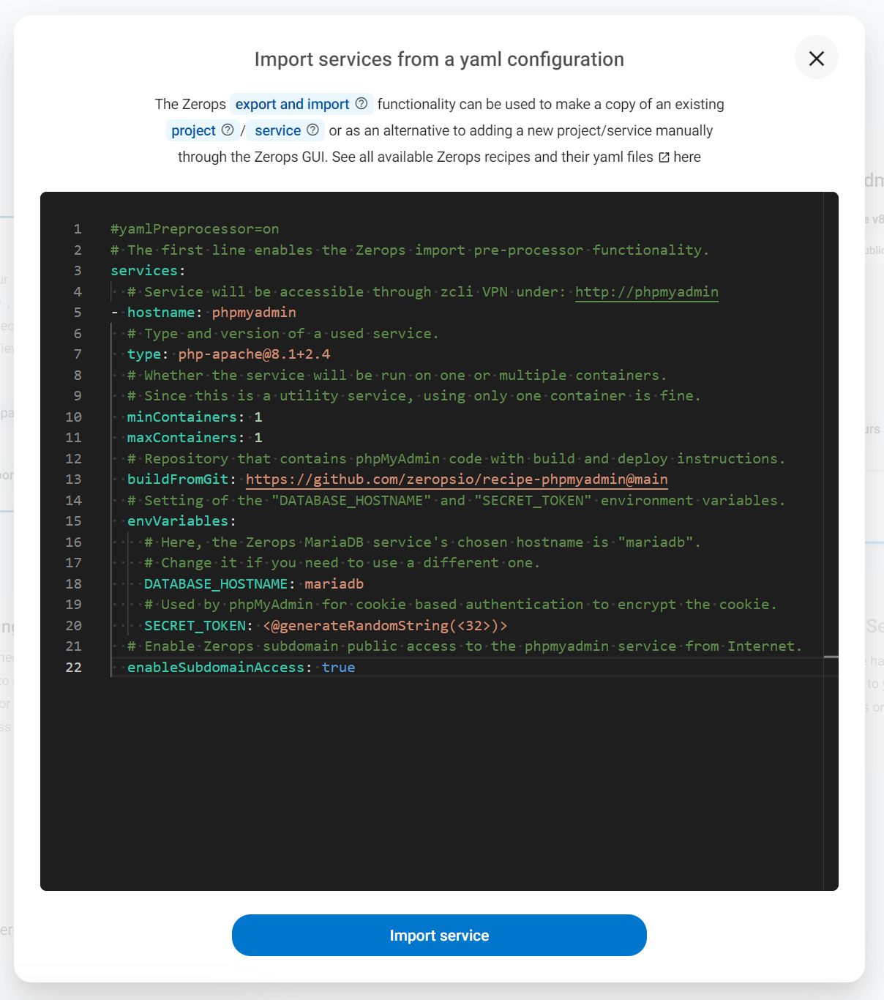
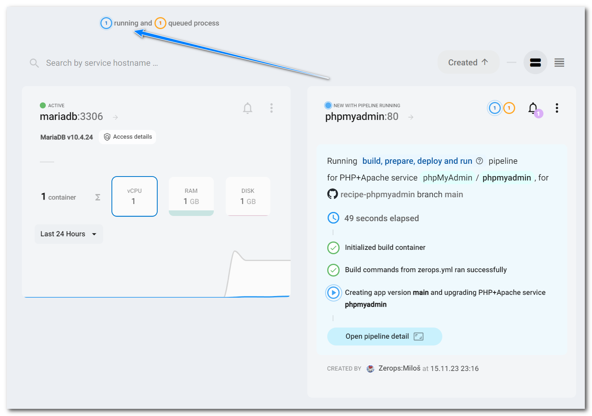
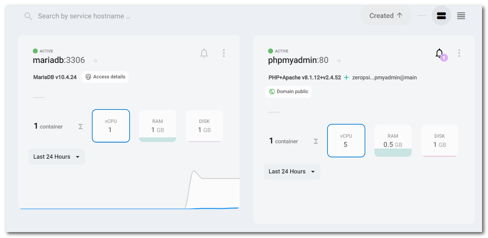
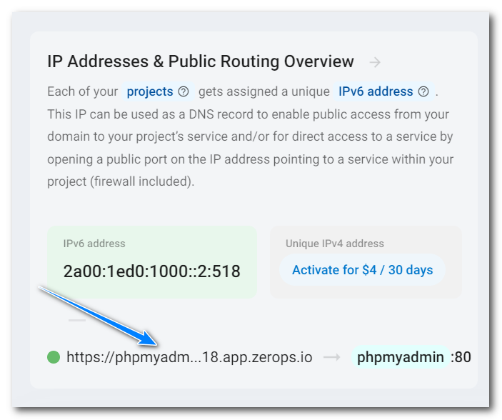
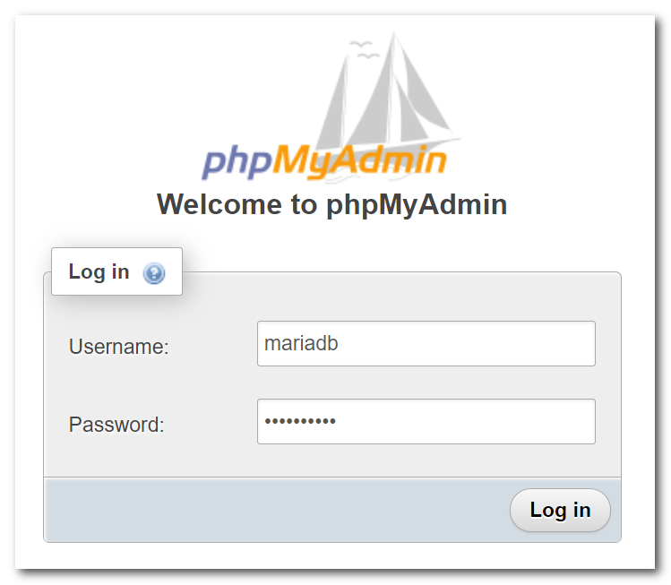
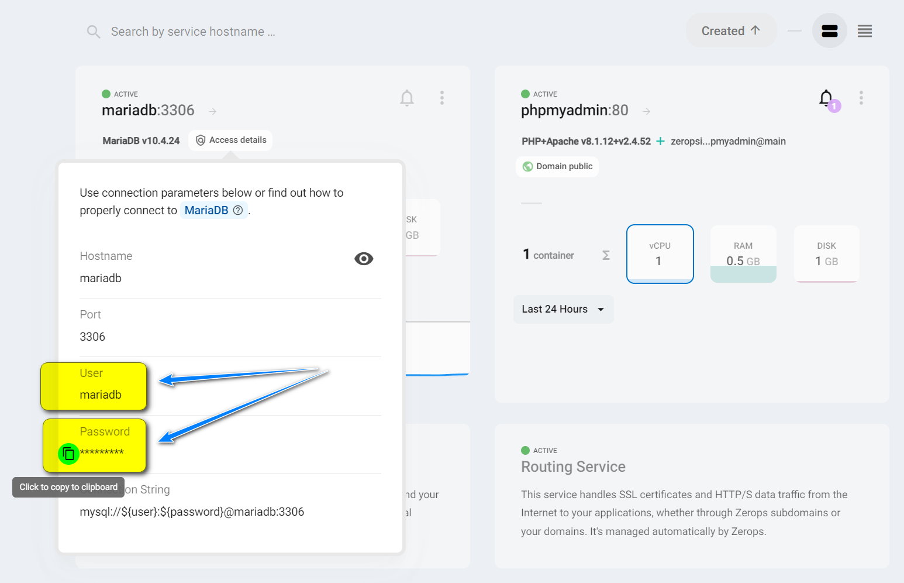
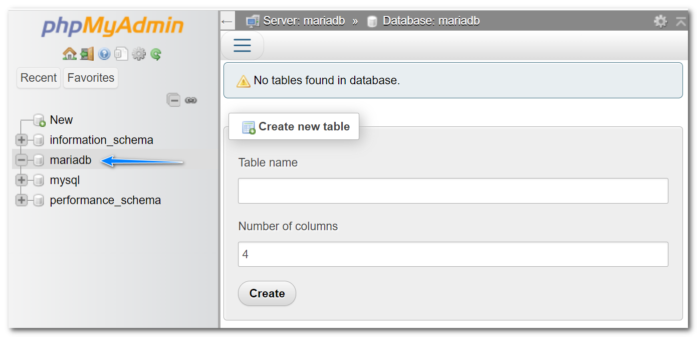

# ZEROPS RECIPES

The concept of pre-prepared skeletons demonstrates the way how to set up and use technologies Zerops is supporting.

## phpMyAdmin 5.2.1

[phpMyAdmin](https://github.com/phpmyadmin/phpmyadmin) is a mature web-based administration tool for MariaDB and MySQL databases.

## Zerops import syntax

```yaml
#yamlPreprocessor=on
# The first line enables the Zerops import pre-processor functionality.
services:
  # Service will be accessible through zcli VPN under: http://phpmyadmin
- hostname: phpmyadmin
  # Type and version of a used service.
  type: php-apache@8.1+2.4
  # Whether the service will be run on one or multiple containers.
  # Since this is a utility service, using only one container is fine.
  minContainers: 1
  maxContainers: 1
  # Repository that contains phpMyAdmin code with build and deploy instructions.
  buildFromGit: https://github.com/zeropsio/recipe-phpmyadmin@main
  # Setting of the "DATABASE_HOSTNAME" and "SECRET_TOKEN" environment variables.
  envVariables:
    # Here, the Zerops MariaDB service's chosen hostname is "mariadb".
    # Change it if you need to use a different one.
    DATABASE_HOSTNAME: mariadb
    # Used by phpMyAdmin for cookie based authentication to encrypt the cookie.
    SECRET_TOKEN: <@generateRandomString(<32>)>
  # Enable Zerops subdomain public access to the phpmyadmin service from Internet.
  enableSubdomainAccess: true
```

Copy & paste the import snippet above into the dialog of **Import service** functionality.



## Using the recipe

1. Use the Zerops [importing](https://docs.zerops.io/documentation/export-import/project-service-export-import.html#how-to-export-import-a-project) functionality to import [recipe service](#zerops-import-syntax) into your already existing Zerops project.

2. Wait till the moment when a service will be created and running.




3. In the **IP Addresses & Public Routing Overview** panel, click on the already generated and activated public service URL on port 80 to show the login page of **phpMyAdmin**.




7. As the **Username** enter the [chosen hostname](https://docs.zerops.io/documentation/services/databases/mariadb.html#hostname-and-ports) of the Zerops MariaDB service you want to access. The **mariadb** value was mentioned above and shown in the import syntax.

8. The user password can be taken from the **Database access details** section of the Zerops MariaDB service.



9. The [default database](https://docs.zerops.io/documentation/services/databases/mariadb.html#default-mariadb-database) should be fully accessible.



10. In the end, **don't forget to disable** the Zerops subdomain access. Finally, you can delete the service from your project to keep it clear and **save your free or paid Zerops credit** because you can always recreate it entirely from the beginning.

11. Instead of using a Zerops subdomain, you can [map your public domain](http://docs.zerops.io/documentation/routing/using-your-domain.html) to access the service.
